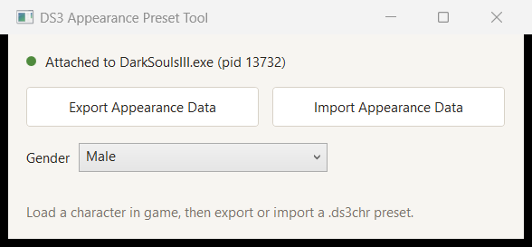

# DS3 Appearance Preset Tool
Tool for importing and exporting character appearance presets in Dark Souls III.
A DS3 analogue of [DSAppearancePresetTool](https://github.com/BobDoleOwndU/DSAppearancePresetTool)
by BobDoleOwndU, which does the same for Dark Souls Remastered/PTDE.

## Usage
### Exporting
1. Run the tool before or after starting Dark Souls III — it attaches on its own.
2. Load the character you wish to export.
3. Click the *Export Appearance Data* button.
4. Choose where the file will export to.
5. Done! Your character's look will be exported to the chosen location as a .ds3chr file.

### Importing
1. Run the tool and load the character you wish to change.
2. Click the *Import Appearance Data* button.
3. Select the .ds3chr file you wish to import the data from.
4. The tool opens **Alter Appearance** (Rosaria's menu) and writes the look into it.
5. Confirm in the menu to keep it.

### Gender
Pick a value in the *Gender* list and it goes into the game at once. Gender is what
Rosaria charges for, so change it with the appearance menu open.

### Notes
Needs .NET 8 (Windows Desktop). Run the tool as administrator if it cannot open the game.

The tool writes into the game's memory, so **do not play online with it** and back up
your save first. How it works inside: [docs/internals.md](docs/internals.md).

## Credits
Igromanru for the appearance offsets and the Alter Appearance script in his Cheat Table.
BobDoleOwndU for DSAppearancePresetTool, the tool this one mirrors.

MIT licensed, see `LICENSE`.
